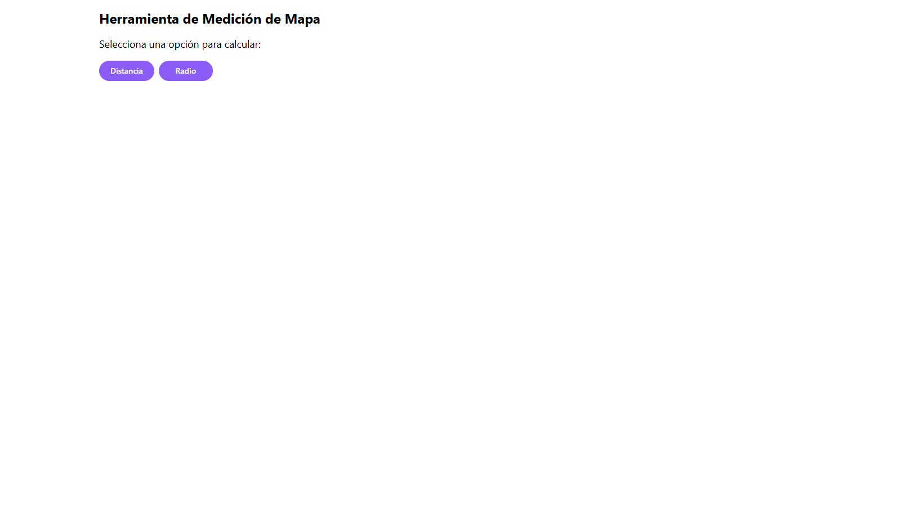

# Google Maps Measurement Tool

An interactive web application that allows users to measure areas and radii directly on a map using the Google Maps API. Built with **React** and **TypeScript**, this tool offers a user-friendly interface for quick and accurate geographic measurements.

## 🌐 Access the Application

You can access the production application at the following link: [Google Maps Measurement Tool](https://measuremap.vercel.app)

## 📸 Screenshots

Here are some screenshots showcasing the application:

### Home Page


_Main interface for selecting measurement modes and interacting with the map._

### Area Measurement

  
_Drawing polygons to calculate the area within._

### Radius Measurement

  
_Creating circles to measure radii._

## 🛠️ Built With

- **[React](https://reactjs.org/):** Library for building user interfaces.
- **[TypeScript](https://www.typescriptlang.org/):** Static typing for reliable code.
- **[Vite](https://vitejs.dev/):** Fast and modern build tool.
- **[Google Maps API](https://developers.google.com/maps):** Map rendering and geographic computations.
- **[TailwindCSS](https://tailwindcss.com/):** Utility-first CSS framework for styling the UI.

## Features

1. **Area Measurement:**

   - Draw polygons directly on the map.
   - Calculate the area inside the polygons in square meters or kilometers.

2. **Radius Measurement:**

   - Place circles on the map.
   - Measure radii and total coverage.

3. **Interactive User Interface:**

   - Toggle between measurement modes.
   - Responsive design for desktop and mobile.

4. **Custom Styling and Integration:**
   - Predefined styles for better visualization.
   - Leveraging **@react-google-maps/api** for seamless integration with Google Maps.

## 🚀 Installation

Follow these steps to set up the project locally:

1. Clone the repository:

   ```bash
   git clone https://github.com/Jonlle/google-maps-measure-tools.git
   cd google-maps-measure-tools
   ```

2. Install the dependencies:

   ```bash
   npm install
   ```

3. Obtain a Google Maps API key:

   - Visit the [Google Cloud Console](https://console.cloud.google.com/) and create a new project.
   - Enable the "Maps JavaScript API."
   - Generate an API key and add it to a `.env` file in the root directory:
     ```
     REACT_APP_GOOGLE_MAPS_API_KEY=your_api_key_here
     ```

4. Start the development server:

   ```bash
   npm run dev
   ```

5. Open [http://localhost:3000](http://localhost:3000) to view the application.

## Contribution

Contributions are welcome! If you'd like to improve this project, please follow these steps:

1. Fork the repository.
2. Create a new branch:
   ```bash
   git checkout -b feature/new-feature
   ```
3. Make your changes and commit them:
   ```bash
   git commit -m 'Add new feature'
   ```
4. Push to your fork:
   ```bash
   git push origin feature/new-feature
   ```
5. Submit a Pull Request.

😊
